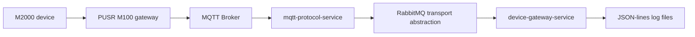

# Architecture

The current SignalEyes architecture is a one-way telemetry ingestion pipeline.

## Components

| Component | Role |
|---|---|
| M2000 device | Field equipment that exposes telemetry as Modbus input-register data. |
| PUSR M100 gateway | MQTT-capable device gateway that publishes field telemetry to the broker. |
| MQTT Broker | Receives published telemetry topics and makes them available to subscribers. |
| `mqtt-protocol-service` | Subscribes to telemetry topics, validates topic structure, extracts identifiers, detects payload encoding, and creates `RawMqttMessage` records. |
| Internal transport abstraction | Carries raw MQTT messages between services using RabbitMQ in the current implementation. |
| `device-gateway-service` | Receives raw MQTT messages, validates required fields, creates `CanonicalDeviceEvent` records, maps M2000 input-register telemetry, and writes logs. |
| JSON-lines log files | Local append-only files used for traceability and phase verification. |

## Direction

Telemetry flows from devices to log files only. This phase does not send commands, write remote configuration, expose an API, or persist to a database.
