# M100 and M2000 Setup User Manual

This guide configures an Exicom M2000 controller to expose Modbus TCP telemetry, configures a PUSR M100 gateway to poll it, and reports the mapped values to SignalEye over MQTT.

## 1. Target Setup

| Component | Example address or identifier | Purpose |
|---|---|---|
| M2000 controller | `192.168.0.2` | Modbus TCP data source. |
| PUSR M100 | `192.168.0.7` | Modbus-to-MQTT edge gateway. |
| SignalEye server | `192.168.0.10` | MQTT broker and telemetry processor. |
| Modbus TCP port | `502` | M100-to-M2000 connection. |
| MQTT port | `1883` | M100-to-SignalEye connection without TLS. |
| MQTT client ID | `123456` | Unique M100 MQTT client identifier. |

All three devices must be reachable on the same LAN for this example. Replace the example addresses and identifiers when deploying to another site.

## 2. Required Files

- [M100 M2000 polling map](../../config/m100/mappings/m2000.csv)
- [M100 MQTT JSON template](../../config/m100/templates/telemetry.json)
- [SignalEye server-side mapping](../../config/modbus/edge-EN.csv)

The M100 JSON template is minified and must remain below the device limit of 2,048 bytes. Upload or paste the checked-in file without formatting it.

## 3. Configure the M2000

### 3.1 Sign in

1. Connect the commissioning computer to the M2000 network.
2. Open the M2000 IP address in a browser.
3. Sign in with an authorized engineering account. Do not record passwords in this repository or this manual.

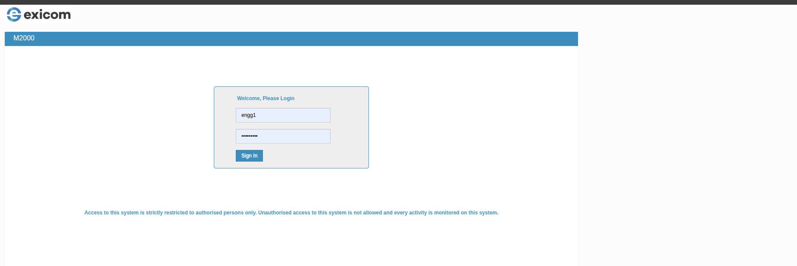

### 3.2 Configure Ethernet

1. Open **Settings → Communication Settings → Ethernet**.
2. Select a static IPv4 configuration.
3. For the example installation, set:

   - IP address: `192.168.0.2`
   - Subnet mask: `255.255.255.0`
   - Default gateway: `192.168.0.1`

4. Apply the IP settings.

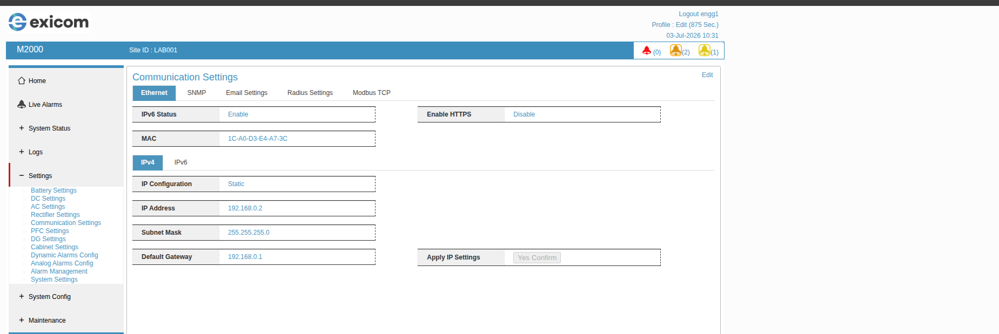

Changing the IP address may disconnect the browser session. Reconnect using the new address.

### 3.3 Enable Modbus TCP

1. Open **Settings → Communication Settings → Modbus TCP**.
2. Select **Edit**.
3. Set **ModbusTCP Enable** to **Enable**.
4. Set **TCP Port** to `502`.
5. Set **Request TimeOut** to `1000 ms`.
6. Confirm that the M100 can reach `192.168.0.2:502`.

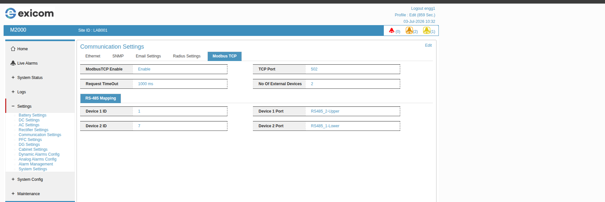

The current M100 polling profile uses Modbus slave address `1` and function code `4` for input registers.

## 4. Import the M2000 Mapping into the M100

1. Sign in to the M100 web interface.
2. Open **Gateway → Edge Computing → Data Acquisition**.
3. Choose the CSV import option.
4. Select [`config/m100/mappings/m2000.csv`](../../config/m100/mappings/m2000.csv).

The M100 import file contains the controller address, slave address, polling interval, node names, function codes, register addresses, and data types. Review these values before importing whenever the site network or connected controller changes.

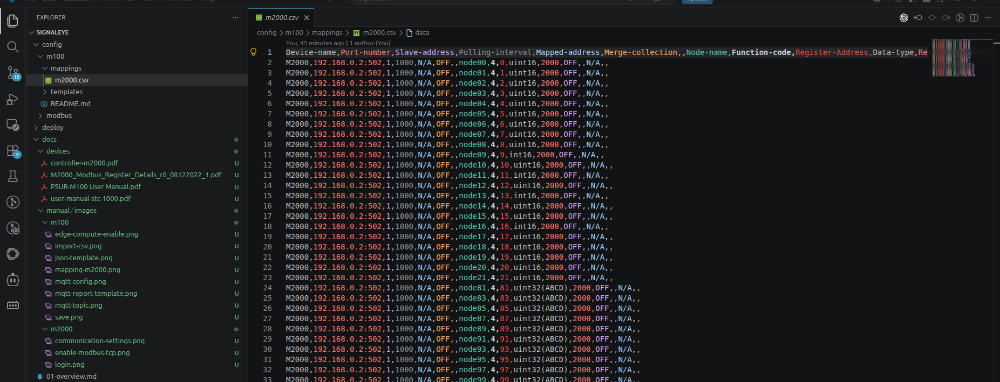

5. Confirm the imported device shows:

   - Name: `M2000`
   - Point source: `192.168.0.2:502`
   - Slave address: `1`
   - Nodes beginning with `node00`

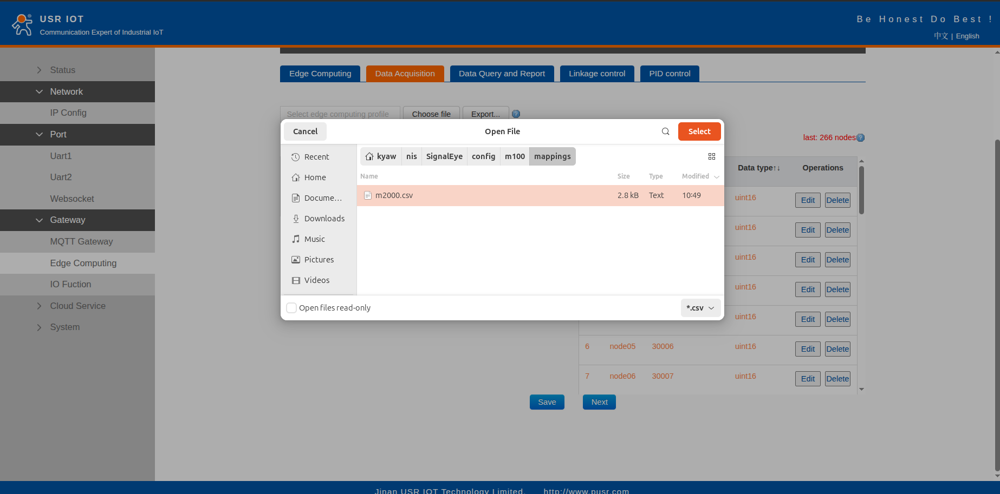

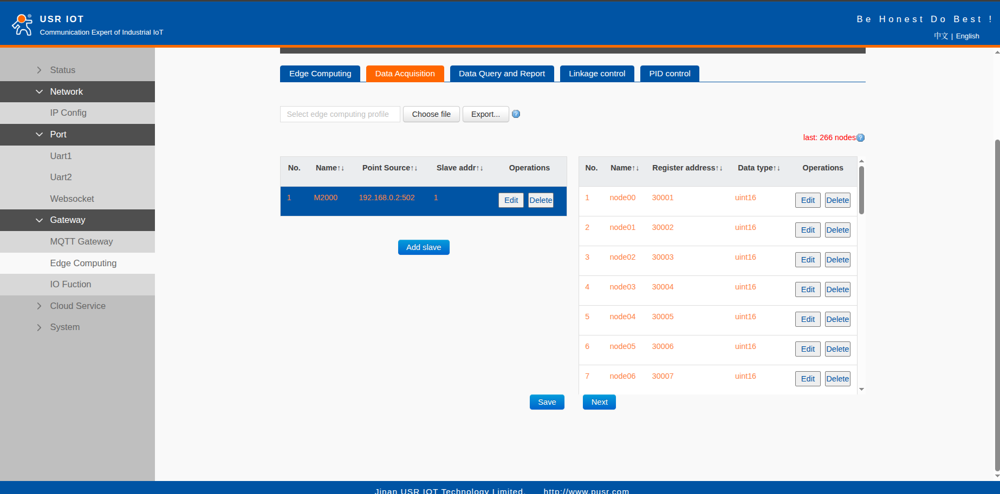

6. Select **Save**. If the M100 asks to restart, choose **Restart** after completing the remaining MQTT settings.

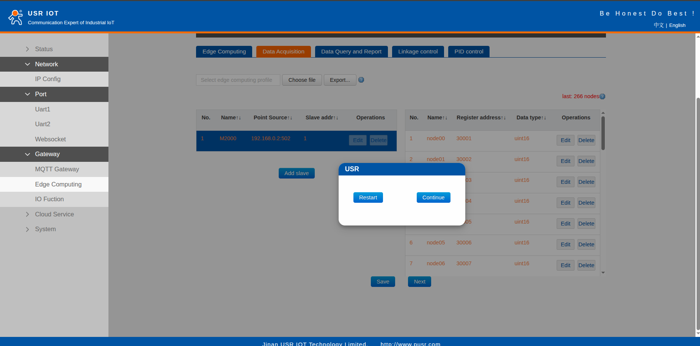

## 5. Configure the M100 MQTT Connection

Open **Gateway → MQTT Gateway** and configure:

| Field | Example value |
|---|---|
| Enable MQTT | `Enable` |
| MQTT version | `MQTT-3.1` |
| Client ID | `123456` |
| Server address | `192.168.0.10` |
| Remote port | `1883` |
| KeepAlive | `60` seconds |
| Reconnection interval | `5` seconds |
| User credentials | Enabled |
| Username | Value from the server's `MQTT_USERNAME` setting |
| Password | Value from the server's `MQTT_PASSWORD` setting |
| Enable last will | Enabled |
| Will QoS | `QoS 1` |
| Will retained | Enabled |

Use deployment-specific secrets and keep them out of screenshots, source control, and documentation.

## 6. Configure the Four MQTT Topics

For gateway `m100-001` at the example site, use:

| M100 field | Direction | Topic |
|---|---|---|
| Query or Set Topic | SignalEye → M100 | `signaleye/demo/site-1/m100-001/command` |
| Respond Topic | M100 → SignalEye | `signaleye/demo/site-1/m100-001/response` |
| Topic of will | M100 → SignalEye broker | `signaleye/demo/site-1/m100-001/status` |
| Report Topic | M100 → SignalEye | `signaleye/demo/site-1/m100-001/telemetry` |

General format:

```text
signaleye/{tenantId}/{siteId}/{gatewayId}/command
signaleye/{tenantId}/{siteId}/{gatewayId}/response
signaleye/{tenantId}/{siteId}/{gatewayId}/status
signaleye/{tenantId}/{siteId}/{gatewayId}/telemetry
```

The current SignalEye phase ingests only the `/telemetry` topic. The command, response, and status topics establish the M100 configuration contract for later server-side command and presence support; they are not yet processed into SignalEye telemetry logs.

Use `offline` as the Last Will message. The Last Will should be retained so consumers can read the latest connectivity state. Do not retain normal telemetry or command responses unless a specific integration requires it.

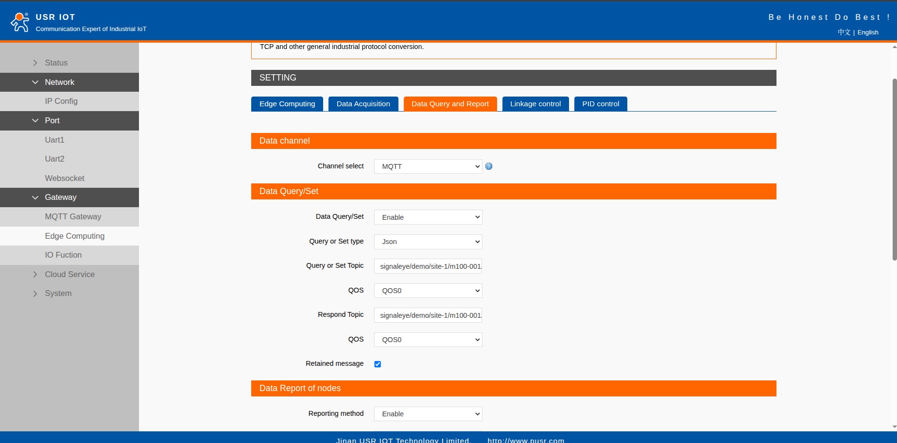

## 7. Configure Telemetry Reporting

1. Open **Gateway → Edge Computing → Data Query and Report**.
2. Select the MQTT channel.
3. Enable **Data Report of nodes**.
4. Set **Report Topic** to the telemetry topic from the previous section.
5. Select the required reporting interval. The screenshot shows `3000` seconds; choose a value appropriate for the operational requirement and network capacity.
6. Paste the complete contents of [`config/m100/templates/telemetry.json`](../../config/m100/templates/telemetry.json) into **Json template**.
7. Confirm that the M100 reports the template as less than 2,048 bytes.
8. Select **Save**.

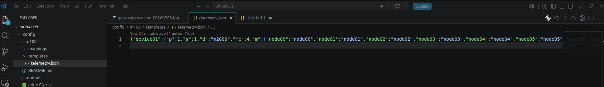

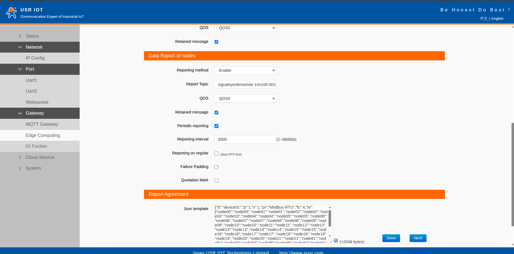

## 8. Enable Edge Computing

1. Open **Gateway → Edge Computing → Edge Computing**.
2. Set **Enable Edge Computing** to **Enable**.
3. Select **Save** and restart the M100 if prompted.

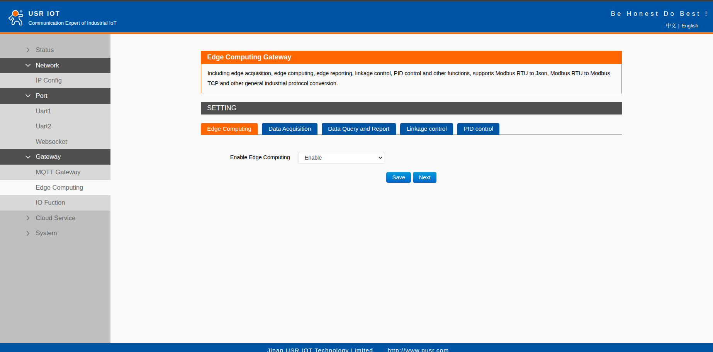

## 9. Start SignalEye

From the repository root:

```bash
docker compose --env-file deploy/docker/.env \
  -f deploy/docker/compose.yaml up -d
```

Confirm that all services are running:

```bash
docker compose --env-file deploy/docker/.env \
  -f deploy/docker/compose.yaml ps
```

The MQTT endpoint for this example is `192.168.0.10:1883`.

## 10. Verify Telemetry

Watch the MQTT service for a successful connection and forwarded messages:

```bash
docker compose --env-file deploy/docker/.env \
  -f deploy/docker/compose.yaml logs -f mqtt-protocol-service
```

Watch processed telemetry directly on the host:

```bash
tail -F logs/device-gateway-service/gateway-processed-$(date -u +%Y%m%d).log
```

A mapped `node08` reading should resemble:

```json
{
  "deviceKey": "device01",
  "deviceModel": "m2000",
  "name": "Rectifier Bus Voltage",
  "value": "54.1",
  "unit": "Volt"
}
```

## 11. Troubleshooting

### MQTT client is rejected

If the server reports `Rejected MQTT connection from client 123456`, the M100 reached the broker but its username or password does not match `deploy/docker/.env`. Correct the M100 credentials and reconnect.

### MQTT connects but no telemetry is logged

Check that:

- the report topic ends in `/telemetry`;
- edge computing and node reporting are enabled;
- the M2000 CSV was imported and saved;
- the JSON template is complete and below 2,048 bytes;
- the reporting interval has elapsed; and
- the M100 can reach the M2000 on TCP port `502`.

### Nodes are reported but unmapped

Confirm that the group profile is lowercase `m2000`, the node exists in `config/modbus/edge-EN.csv`, and the function code and node name match the imported M100 mapping.

### Security notes

- Port `1883` is unencrypted. Use it only on a trusted private network until TLS is configured.
- Replace lab credentials before production deployment.
- Restrict access to the M2000 and M100 administration interfaces.
- Back up the M100 configuration after successful commissioning.

## 12. Reference Material

- [PUSR M100 user manual](../devices/PSUR-M100%20User%20Manual.pdf)
- [M2000 controller manual](../devices/controller-m2000.pdf)
- [M2000 Modbus register details](../devices/M2000_Modbus_Register_Details_r0_08122022_1.pdf)
- [STC-1000 manual](../devices/user-manual-stc-1000.pdf)
- [SignalEye protocol mapping](../07-protocol-mapping.md)
- [SignalEye run and deployment guide](../10-run-build-deploy.md)
- [SignalEye logging guide](../12-logging-standard.md)
